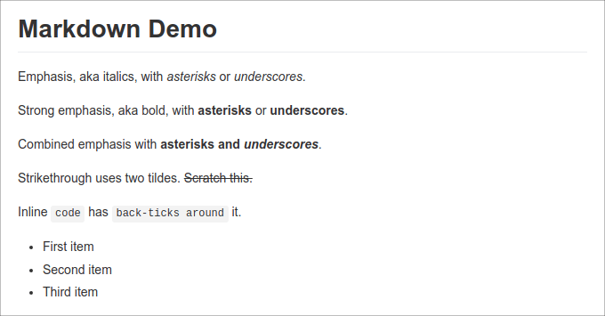

# GitHub Flavored Markdown Stylesheet

GitHub Flavored Markdown Stylesheet - Version of the »sindresorhus/github-markdown-css« stylesheet with a body style and without the »markdown-body« prefix.

_⭐ You like this package? Please star it or send a tweet. ⭐_

## Vision

This package provides a ready build stylesheet to style an HTML document
generated from GitHub Flavored Markdown.

It uses the great [sindresorhus/github-markdown-css](https://github.com/sindresorhus/github-markdown-css)
package as base. It adds custom body styles and removes all occurences of the
`markdown-body` prefix. This way the resulting stylesheet styles a document
without the need to add a `markdown-body` wrapper tag to it.

## Requirements

- None

## Installation

Download [manually](https://gitlab.com/pixelbrackets/gfm-stylesheet/-/raw/master/dist/gfm.css?inline=false)
or use a CDN like [jsDelivr](https://cdn.jsdelivr.net/gh/pixelbrackets/gfm-stylesheet/dist/gfm.min.css).

## Source

https://gitlab.com/pixelbrackets/gfm-stylesheet/

Mirror https://github.com/pixelbrackets/gfm-stylesheet/ (Issues & Pull Requests
mirrored to GitLab)

## Demo

🚀 https://markdown-mini-page.app.pixelbrackets.de/

## Usage

Import the `gfm.css` file. That's it.

📦 A minified version, named `gfm.min.css`, is available as well.

## License

GNU General Public License version 2 or later

The GNU General Public License can be found at http://www.gnu.org/copyleft/gpl.html.

## Author

Dan Untenzu (<mail@pixelbrackets.de> / [@pixelbrackets](https://pixelbrackets.de))

## Changelog

See [CHANGELOG.md](./CHANGELOG.md)

## Contribution

This script is Open Source, so please use, share, patch, extend or fork it.

[Contributions](./CONTRIBUTING.md) are welcome!

## Feedback

Please send some [feedback](https://pixelbrackets.de/) and share how this
package has proven useful to you or how you may help to improve it.
